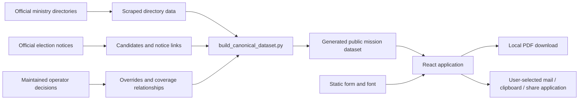

# Architecture and maintenance contracts

This describes the shipped browser application and its build-time contact data. Start with [AGENTS.md](../AGENTS.md) for domain judgment and deployment rules. For operational commands, use [election-contact operations](election-contact-operations.md). Those documents own their respective rules; this page explains where they meet the application.

## System boundaries

There is no application submission API or personal-data database. Crawling and data generation run outside the browser. The website reads the generated dataset; it does not crawl mission websites or approve recipients at runtime. Opening an official link is a separate user action.

## Source map

| Concern | Owner | Contract |
| --- | --- | --- |
| Mounting and service worker | `src/main.tsx`, `public/sw.js` | Production static-resource caching; no storage of form fields |
| Routes, step progression, application state | `src/App.tsx` | Own sensitive data in React memory and clear it together on reset |
| Script selection | `src/lib/script.ts` | Transliterate static copy; preserve user-entered content |
| Country browsing | `src/components/RegistrationEmailStatusPage.tsx` | List all countries and distinguish mission approval from polling-place availability |
| Country/mission selection | `src/components/StepVotingDestination.tsx` | Resolve stable IDs within the chosen country; retain separate consulates |
| Country decoration | `src/components/CountryFlag.tsx`, `public/assets/flags/` | Local SVGs keyed by country code; written names remain the accessible label |
| Evidence and inquiry links | `ElectionNoticeLink.tsx`, `MissionInquiryLink.tsx`, `src/lib/missionInquiry.ts` | Show maintained evidence or a user-initiated question without changing approval |
| Signature and ID image | `src/components/StepSignatureAndDocument.tsx` | Validate/normalize image locally; distinguish drawn and paper signatures |
| PDF assets and layout | `src/lib/pdf.ts` | Reuse public assets; generate each personal document locally |
| Export and handoff | `src/components/StepExportAndSubmit.tsx`, `src/lib/share.ts` | Generate/download/share on the user's behalf only at the relevant UI action; sending stays with the user |
| Privacy dialog | `src/components/PrivacyPolicyModal.tsx` | Explain data boundaries and readiness; own dialog focus and keyboard lifecycle |
| Data generation | `scripts/build_canonical_dataset.py` | Generate canonical JSON and TypeScript together; preserve provenance |

Paths without a directory in this table are in `src/components/`.

## Routes and state transitions

The application has two surfaces: `/` for the five-step form and `/status` for country coverage. `App.tsx` chooses the surface without a router dependency. Links between them load a new document; they do not retain a draft application.

| Entry | Starting state | Meaning |
| --- | --- | --- |
| `/` | Step 1, registry guidance | The app cannot read the external voter-register result |
| `/?country=AT` | Step 2, country preselected | A coverage-page shortcut; registry verification is **not** marked complete |
| `/?destination=...` | Step 1, proposed voting location prefilled | Invitation hint only; no inferred country, jurisdiction or personal information |
| `?script=latin` | Latin interface | Internal links carry this parameter; default is Cyrillic |
| Unknown or duplicate country parameters | Step 1, no country selection | Ambiguous input does not silently choose a destination |

Steps are registry guidance → personal details → destination → signature/document → export. The shell retains submitted step values for back navigation. Selecting a country resolves a station from that country's current list. A separate consulate has its own ID and recipient. The signature canvas is recreated when its step remounts, requiring a fresh drawn signature before continuing. Reset clears every application field, selection and document in memory; it cannot delete already downloaded files or clipboard contents.

The final page always offers a registry reminder, including when a country link skipped step 1. It does not claim a request was sent or accepted.

## Loading, memory and offline preparation

`App.tsx` starts preparation in its mount effect, without blocking the initial screen. It calls the same dynamic-import loaders used by `React.lazy` for the signature and export screens, plus `preloadPdfResources()` for the nested PDF dependencies, official template and font. This happens on both routes. A later full-page navigation starts another application instance.

`pdf.ts` owns a single shared promise for the public template/font bytes. Startup and an early export share any in-flight fetch. Successful bytes remain in module memory for the open document; export does not fetch them again. The pair is published only after both response bodies finish. Failure clears the promise, allowing a later export or the browser's `online` event to retry. PDF engines use identical dynamic imports during preload and generation, so the browser reuses their modules.

The privacy dialog reports `loading`, `ready` or `error`. `ready` means the later screens, engines, template and font have all loaded. At that point the **open form** can progress and generate/download its PDF without network access. This readiness state is not based on `navigator.onLine`, which cannot prove that any particular resource is available.

Keep these caches separate:

| Storage | Contents | Lifetime |
| --- | --- | --- |
| Module promise / module cache | Public template, font, JS dependencies | Open document |
| React state and export refs | Applicant fields, image, signature, generated PDF | Current application / mounted export step |
| Existing service worker Cache Storage | Successful public same-origin GET resources | Browser-managed, across page loads |

The production service worker provides additional shell/asset caching. It is not the proof for the in-memory guarantee. It cannot guarantee arbitrary offline navigation: a first visit, uncached chunks or flags, browser eviction, and external sites still need a connection. Flags are decorative and lazily requested; they do not gate filling or PDF generation. Sending an email needs the user's mail service. No new service worker or personal-data persistence was introduced for preloading.

The existing worker activates with `skipWaiting` and `clients.claim`; `main.tsx` reloads on controller change. If changing that lifecycle, account for a draft being memory-only and test upgrades as well as a fresh visit. Asset names with long-lived immutable HTTP caching must be versioned when their content changes, especially the template and font.

## Script and document contracts

Keep English names such as Web Share, Gmail and Apple Mail outside translated text spans. Passing them through Serbian transliteration produces mixed-script labels. Test the final rendered heading when editing these spans.

Use `useScript().t()` or `translateStaticText()` for fixed UI/email copy. Choose `label`/`labelCyr` and `embassy`/`embassyCyr` from the dataset for country and mission names. Do not transliterate an entire assembled email: that would alter a person's name, address, email address or other entered content. `buildRecipientPayloads` receives the selected script and preserves caller-supplied subject/body/name; its default remains Cyrillic for existing callers.

The application form is an official fixed PDF. Its printed labels and mission field remain Cyrillic independently of the interface script; typed applicant values stay as entered. Changing the UI to Latin is not a request to translate or replace the official template. `pdf.ts` uses fixed coordinates, wrapping and an embedded Serbian-capable font. Replacing the template requires rendered-page inspection, not only successful PDF parsing.

A drawn signature is embedded in the form. Paper-signature mode leaves that box empty and tells the person to print, sign and scan/photograph. An optional normalized ID image becomes a separate second page. Export reuses one generated document per mounted export step; navigating back unmounts that cache, so edited fields produce a new PDF.

## Coverage, inquiry and evidence

The three approval states are `source-confirmed`, `operator-approved`, and `unconfirmed`. Both approved states are usable election recipients. `isElectionContactConfirmed` is a narrower legacy field, not the UI's approval gate.

Country, receiving mission and publishing website are separate identities:

| Case | Recipient and evidence behavior |
| --- | --- |
| Embassy and its non-resident countries | Approve the embassy first, then apply its recipient and notice to established dependents; Singapore/Jakarta and Ireland/London are examples. |
| Independent consulates in the same country | Keep separate station IDs and office-specific evidence. An explicitly shared email is allowed; a shared country or host is insufficient. |
| Separate office in a shared announcement | Preserve the named office recipient. Malta uses its own mailbox in Rome's joint notice. In the current registry it is a separate resident station, not a non-resident alias. |

New non-resident approvals require an approved recipient at the covering mission first. Jurisdiction alone cannot approve a mailbox. `validate_covering_recipient_approvals` runs after recipient resolution and before either generated file is written. It rejects new inconsistencies and parent approval downgrades that leave approved dependents. An unchanged historical inconsistency produces a warning and retains published state for operator correction. The previous local canonical input supports only that preservation exception; the live deployment comparison remains a separate requirement.

Explicit relationship fields remain stored separately: the guard checks approval consistency but does not synchronize mailboxes or overwrite office-specific exceptions. Review the parent and all dependent relationships/overrides together after a recipient change. See [AGENTS.md](../AGENTS.md#approval-must-start-with-the-covering-mission) and the [layered coverage review](operator-approved-recipient-handoff.md#georgiaarmenia-correction-and-release--16-september-2026).

Discovery schedules by host but preserves country/station-specific tasks and MFA source chains. Its response cache avoids repeated HTTP fetches of shared notices. Exact mailbox attribution protects known separate recipients (including Rome/Malta); an unknown address on a multi-station task can still need review. Collection starts with the responsible mission, then maintained data propagates approved coverage. Extraction alone never approves dependents. Images and scanned PDFs still need direct visual inspection when text extraction misses the instructions.

Coverage summaries count **station records**, including already resolved non-resident entries. All approved is green; some approved is amber/partial; none approved is red. Partial means that some listed missions have a confirmed election recipient while others do not. It does not mean a geographic percentage of the country is covered or that a polling station will open. Country grouping uses Serbian collation and treats Latin `Dž`, `Lj` and `Nj` as single initial letters. Native `
` keeps the entire country list searchable and keyboard operable.

An inquiry link is offered only for an unconfirmed mission with a syntactically valid published email and a country name. Its text asks for instructions, the election recipient and the notice URL. It uses the already resolved contact and the applicant's selected country, which can differ from the mission's host country. It includes no personal form fields and performs no sending. The election date/deadline/source are maintained copy in `missionInquiry.ts`; review them deliberately at election rollover.

A notice URL and recipient approval are independent facts. Render the exact current notice when present, including inherited covering-mission evidence. A recorded `not-published` status can coexist with an operator-approved recipient. Missing or inaccessible evidence does not automatically remove public coverage.

The authoritative input files and precedence rules are listed in [AGENTS.md](../AGENTS.md#non-resident-recipients-and-maintained-data). Never hand-edit `data/missions_canonical.json` or `src/data/missions.ts`. Use stable station IDs in comparisons; additions cannot offset a loss at another station. A mission override with `_excludeFromPublic: true` is the narrow correction path for a directory row that is not actually a diplomatic or consular mission. The builder validates that the named raw station exists before filtering it, so a changed upstream identity fails visibly instead of silently leaving the bad row in public data.

## Handoff and privacy

`mailto:` and provider compose links contain recipient/subject/body but cannot attach the generated PDF. The interface therefore offers download and explicit attachment instructions. Native Web Share can pass a file when supported, but cannot guarantee the target recipient or prove sending. Clipboard and share failures/cancellation have separate feedback. Inquiry and invitation messages use their own payloads; invitations carry the proposed location and script, not an application or guessed country.

The privacy dialog traps keyboard focus while open, closes with Escape or a backdrop click, and restores focus/scroll state on close. Its close callback is stable so a background loading-status update does not restart the focus effect. Keep this lifecycle intact when editing dialog content.

## Verification and maintenance

Run `bun run check`, `bun test`, and `bun run build` for application changes. Test behavior at the boundary affected by the change. For loading changes, use a production preview and test an open form after disconnecting the network; bypass the service worker and HTTP cache to distinguish memory reuse from cached responses. Also force a template fetch failure and confirm a retry works without losing entered fields.

For flow changes, check both scripts, supported and unconfirmed missions, direct and coverage entry, separate consulates, both signature modes and optional ID images. Inspect screenshots and rendered PDFs. Capture handoff payloads without sending test applications to real missions. [The release QA report](release-visual-qa-2026-09-14.md) records what was actually checked and the limitations of browser emulation.

Before deploying, rebuild data and compare each public station's email/approval with a verified live release. Follow the loss gate in AGENTS.md; a TypeScript build cannot establish recipient coverage. Hosting configuration and credentials remain operator-owned.

For comments, document ownership, invariants, reasons and non-obvious failure behavior beside the relevant code. Update this map when responsibilities change. Keep historical investigation results in audits; avoid duplicating approval decisions or generated datasets here. Comments explain working code; they should not accumulate disabled implementations.

Implementation references: [React lazy loading](https://react.dev/reference/react/lazy) describes its promise caching; [MDN dynamic import](https://developer.mozilla.org/en-US/docs/Web/JavaScript/Reference/Operators/import) explains module reuse. Our explicit asset promise adds byte caching and retry behavior that importing a component alone cannot provide.
