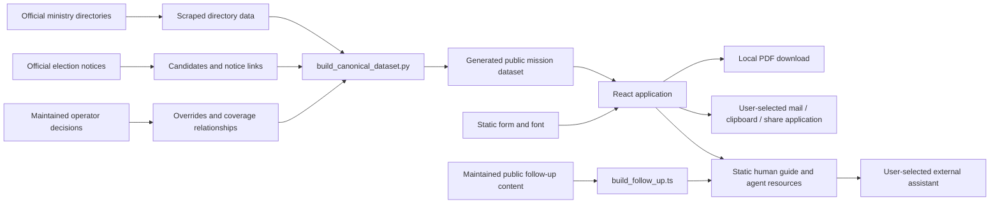

# Architecture and maintenance contracts

This describes the shipped browser application, build-time contact data and public follow-up procedure. Start with [AGENTS.md](../AGENTS.md) for domain judgment and deployment rules. For operational commands, use [election-contact operations](election-contact-operations.md). Those documents own their respective rules; this page explains where they meet the application.

## System boundaries

```mermaid
flowchart LR
  MFA[Official ministry directories] --> Raw[Scraped directory data]
  Notice[Official election notices] --> Evidence[Candidates and notice links]
  Operator[Maintained operator decisions] --> Overrides[Overrides and coverage relationships]
  Raw --> Builder[build_canonical_dataset.py]
  Evidence --> Builder
  Overrides --> Builder
  Builder --> Public[Generated public mission dataset]
  Public --> Browser[React application]
  Assets[Static form and font] --> Browser
  Browser --> PDF[Local PDF download]
  Browser --> Handoff[User-selected mail / clipboard / share application]
  Content[Maintained public follow-up content] --> GuideBuilder[build_follow_up.ts]
  GuideBuilder --> Guide[Static human guide and agent resources]
  Browser --> Guide
  Guide --> Assistant[User-selected external assistant]
```

There is no application submission API or personal-data database. Crawling and data generation run outside the browser. The website reads the generated dataset; it does not crawl mission websites or approve recipients at runtime. Opening an official link is a separate user action.

The optional post-submission follow-up capability is public static content, not a case-management service. `content/follow-up/` owns its assistant playbook, human procedure, templates, workflow and source catalogue. `scripts/build_follow_up.ts` renders both script variants and the public resource files before Vite runs. The generated page's complete manual instructions and all sixteen templates are present in its initial HTML; browser code only enhances copy feedback, fragment navigation and printing. Neither the site nor build receives applicant facts or mailbox data.

## Source map

| Concern | Owner | Contract |
| --- | --- | --- |
| Mounting and service worker | `src/main.tsx`, `public/sw.js` | Production static-resource caching; no storage of form fields |
| Routes, step progression, application state | `src/App.tsx` | Own sensitive data in React memory and clear it together on reset |
| Script selection | `src/lib/script.ts` | Transliterate static copy; preserve user-entered content |
| Country browsing | `src/components/RegistrationEmailStatusPage.tsx` | List all countries and distinguish mission approval from polling-place availability |
| Country/mission selection | `src/components/StepVotingDestination.tsx` | Resolve stable IDs within the chosen country; retain separate consulates |
| Country decoration | `src/components/CountryFlag.tsx`, `public/assets/flags/` | Local SVGs keyed by country code; written names remain the accessible label |
| Station election status | `src/lib/stationElectionStatus.ts` | Pure runtime helper deriving `approved`, `notice-no-email`, and `unconfirmed` presentation states without modifying stored approval data |
| Registration deadline and admission | `src/lib/deadline.ts`, `src/lib/serverTime.ts` | Single source of truth for the target deadline (`2026-10-03T22:00:00Z`), route normalization, pure admission logic, and origin HTTP Date sampling to mitigate clock skew |
| Post-deadline notices | `src/components/PostDeadlineNotice.tsx` | Informative post-deadline screen with official MDULS guidance, voter registry lookup, `/status` archive, follow-up entry and repository link; non-destructive advisory banner for active drafts |
| Evidence and inquiry links | `ElectionNoticeLink.tsx`, `MissionInquiryLink.tsx`, `src/lib/missionInquiry.ts` | Show maintained evidence or a user-initiated question without changing approval |
| PDF assets and layout | `src/lib/pdf.ts` | Reuse public assets; generate each personal document locally |
| Export and handoff | `src/components/StepExportAndSubmit.tsx`, `src/lib/share.ts` | Generate/download/share on the user's behalf only at the relevant UI action; sending stays with the user |
| Privacy dialog | `src/components/PrivacyPolicyModal.tsx` | Explain data boundaries and readiness; own dialog focus and keyboard lifecycle |
| Follow-up guide, prompts and resources | `content/follow-up/`, `scripts/build_follow_up.ts`, `src/lib/followUp.ts` | Generate Cyrillic `/pracenje/`, Latin `/pracenje/latin/`, raw `/pracenje/agent.md` and linked resource documents; validate workflow/template references |
| Follow-up entry and homepage handoff | `src/components/FollowUpEntry.tsx`, `src/App.tsx`, `src/components/StepExportAndSubmit.tsx`, `src/components/RegistrationEmailStatusPage.tsx` | Offer manual next steps and optional user-selected agent launch/copy; do not read mail or submit a request from the website |
| Mission data generation | `scripts/build_canonical_dataset.py`, `data/`, `src/data/missions.ts` | `bun run build:data` resolves maintained recipient/coverage inputs and generates both canonical JSON and public TypeScript; never hand-edit generated datasets |

Paths without a directory in this table are in `src/components/`.

## Routes and state transitions

The application has two browser-rendered surfaces: `/` for the five-step form and `/status` for country coverage. `App.tsx` chooses the surface without a router dependency. Links between them load a new document; they do not retain a draft application. The separate, directly served `/pracenje/` page has Cyrillic and `/pracenje/latin/` variants, plus `/pracenje/agent.md` and related static Markdown/JSON. These files are generated at `predev` and `build`, so hosting serves the HTML/Markdown/JSON itself rather than routing them through the React mount or requiring client JavaScript to retrieve instructions.

`/pracenje/` contains complete manual follow-up steps and all sixteen correspondence templates, with a selectable/copyable social prompt and a separate detailed website prompt. `FOLLOW_UP_SHORT_PROMPT` is exactly `Отвори https://korakdoglasa.org/pracenje/agent.md`; `FOLLOW_UP_DETAILED_PROMPT` asks the assistant to apply the procedure, recover relevant evidence and prepare next steps only within available tools and user permissions. Both are fixed public text and contain no case data. ChatGPT and Claude use best-effort `q` prefill links plus copying; Gemini uses copy-and-open, followed by pasting into its composer. Providers may ignore prefill, and signing in or changing modes may affect it, so copy/paste remains the fallback. These ordinary links do not select Work/Spark/Cowork, submit a message or authorize mail access.

The agent playbook treats mailbox reading, draft creation/modification, sending and formal filing as separate permissions and capabilities. Redacted correspondence supports the path without email access or a special mode. It requires explicit approval of recipients, text and actual attachments before sending, and accurate reporting of drafts/sends/filings. The homepage also shows follow-up help after the registration deadline; links from an active form open the separate guide without resetting its in-memory draft. Copy fallback restores keyboard focus to the triggering control, including after denial. Markdown responses include `charset=utf-8` in Firebase and in Vite development/preview middleware; otherwise a directly opened Cyrillic Markdown file may be misdecoded.

The visible follow-up entry is intentionally short: manual/assistant choices, provider buttons and the social prompt. Detailed setup/privacy copy is disclosed on request; the urgent-remedy warning stays visible. The homepage keeps a four-step manual summary, while the standalone guide avoids repeating it and renders each complete manual section as native `details` in the initial HTML. Sources and templates also use native disclosures. Print handling opens all details and restores their previous states afterward; no case data or agent instructions are removed by this presentation change.

| Entry | Starting state | Meaning |
| --- | --- | --- |
| `/` | Step 1, registry guidance | The app cannot read the external voter-register result |
| `/?country=AT` | Step 2, country preselected | A coverage-page shortcut; registry verification is **not** marked complete |
| `/?destination=...` | Step 1, proposed voting location prefilled | Invitation hint only; no inferred country, jurisdiction or personal information |
| `?script=latin` | Latin interface | Internal links carry this parameter; default is Cyrillic |
| Unknown or duplicate country parameters | Step 1, no country selection | Ambiguous input does not silently choose a destination |

Steps are registry guidance → personal details → destination → signature/document → export. The shell retains submitted step values for back navigation. Selecting a country resolves a station from that country's current list. A separate consulate has its own ID and recipient. The signature canvas is recreated when its step remounts, requiring a fresh drawn signature before continuing. Reset clears every application field, selection and document in memory; it cannot delete already downloaded files or clipboard contents.

The final page always offers a registry reminder, including when a country link skipped step 1. It does not claim a request was sent or accepted.

## Registration deadline lifecycle and post-deadline cutoff

The official diaspora registration deadline for the October 25, 2026 elections is **October 3, 2026 at 24:00 (midnight) Belgrade time** (`2026-10-03T22:00:00Z`).

To avoid requiring manual midnight deployments, DNS flips, or fragile scheduled jobs, the application manages the deadline lifecycle autonomously in the browser:

1. **Single Source of Truth**: `src/lib/deadline.ts` defines `TARGET_DEADLINE_MS`.
2. **Admission State (`'pending' | 'open' | 'closed'`)**:
   - **Pre-deadline fast path**: Visitors arriving more than 1 hour before the deadline initialize synchronously as `'open'`. The wizard renders immediately with zero network delay or loading flash.
   - **Boundary / Post-deadline path**: Visitors arriving within 1 hour or after the deadline initialize as `'pending'` with a 3000ms fail-open fallback.
   - **Origin time synchronization**: On mount, a lightweight same-origin `HEAD /` request samples the HTTP `Date` header to detect client device clock skew. If network fails or times out, it fails open to `'open'`.
3. **In-Progress Session Preservation**:
   - A session with user-entered data (`userEngaged` from any input edit, `currentStep > 2`, un-shortcut `currentStep > 1`, or non-empty personal details/signatures) is **never closed or unmounted**. Country-entry URL shortcuts (`/?country=XX`) start on step 2; if left untouched, post-deadline background synchronization can close them, but editing any field immediately latches progress synchronously, preventing closure.
   - When the deadline passes during an active session, a non-destructive advisory banner (`PostDeadlineNotice variant="advisory"`) appears above the stepper, permitting full completion and PDF download.
4. **Archive Mode on `/status`**:
   - The `/status` route is always accessible immediately without waiting for server time synchronization.
   - For open status tabs, a lightweight boundary timer calculates time remaining against authoritative server-synchronized time and triggers the archive transition at the first scheduled callback at or immediately after the deadline (with a 100ms buffer), or immediately on the next resume/focus event, without 1-Hz CPU polling.
   - In archive mode, new registration buttons and inquiry composer links are hidden, but all embassy listings, emails (including unconfirmed missions), phone numbers, and official election notices remain fully visible and searchable.
5. **Follow-up remains available**:
   - The closed homepage and archive offer the public follow-up entry for already-sent requests; `/pracenje/` and its resources are independent of admission state.
   - This is not a new registration period or evidence that any person's application was accepted.

## Loading, memory and offline preparation

`App.tsx` starts preparation in its mount effect, without blocking the initial screen. It calls the same dynamic-import loaders used by `React.lazy` for the signature and export screens, plus `preloadPdfResources()` for the nested PDF dependencies, official template and font. This happens on both routes. A later full-page navigation starts another application instance.

`pdf.ts` owns a single shared promise for the public template/font bytes. Startup and an early export share any in-flight fetch. Successful bytes remain in module memory for the open document; export does not fetch them again. The pair is published only after both response bodies finish. Failure clears the promise, allowing a later export or the browser's `online` event to retry. PDF engines use identical dynamic imports during preload and generation, so the browser reuses their modules.

The privacy dialog reports `loading`, `ready` or `error`. `ready` means the later screens, engines, template and font have all loaded. At that point the **open form** can progress and generate/download its PDF without network access. This readiness state is not based on `navigator.onLine`, which cannot prove that any particular resource is available.

Keep these caches separate:

| Storage | Contents | Lifetime |
| --- | --- | --- |
| Module promise / module cache | Public template, font, JS dependencies | Open document |
| React state and export refs | Applicant fields, image, signature, generated PDF | Current application / mounted export step |
| Existing service worker Cache Storage | Successful same-origin GET assets except `/pracenje/` resources | Browser-managed, across page loads |

The production service worker provides additional shell/asset caching, but bypasses and does not cache the public follow-up files so their fixed URLs receive current instructions. It cannot guarantee arbitrary offline navigation: first visits, uncached chunks or flags, browser eviction, and external sites still need a connection. Flags are decorative and lazily requested; they do not gate filling or PDF generation. Sending an email needs the user's mail service. The follow-up page itself remains manual-readable once fetched, but its links to official authorities require network access.

The worker deliberately does not call `skipWaiting` or `clients.claim`. A replacement waits for existing controlled pages to close before activation, protecting an open registration draft from an update-forced reload. On `controllerchange`, `main.tsx` reloads only after the previous worker no longer has active controlled pages. If changing this lifecycle, exercise a returning profile and an active in-memory draft. Asset names with long-lived immutable HTTP caching must be versioned when their content changes, especially the template and font.

## Script and document contracts

Keep English names such as Web Share, Gmail and Apple Mail outside translated text spans. Passing them through Serbian transliteration produces mixed-script labels. Test the final rendered heading when editing these spans.

Use `useScript().t()` or `translateStaticText()` for fixed UI/email copy. Choose `label`/`labelCyr` and `embassy`/`embassyCyr` from the dataset for country and mission names. Do not transliterate an entire assembled email: that would alter a person's name, address, email address or other entered content. `buildRecipientPayloads` receives the selected script and preserves caller-supplied subject/body/name; its default remains Cyrillic for existing callers.

The application form is an official fixed PDF. Its printed labels and mission field remain Cyrillic independently of the interface script; typed applicant values stay as entered. Changing the UI to Latin is not a request to translate or replace the official template. `pdf.ts` uses fixed coordinates, wrapping and an embedded Serbian-capable font. Replacing the template requires rendered-page inspection, not only successful PDF parsing.

A drawn signature is embedded in the form. Paper-signature mode leaves that box empty and tells the person to print, sign and scan/photograph. An optional normalized ID image becomes a separate second page. Export reuses one generated document per mounted export step; navigating back unmounts that cache, so edited fields produce a new PDF.

## Follow-up content maintenance

Edit sources in `content/follow-up/`, not ignored `public/pracenje/` or `dist/`. `bun run build:follow-up` runs the existing Bun script `scripts/build_follow_up.ts`; `predev` invokes it for `bun run dev`, and `bun run build` invokes it before TypeScript/Vite. Keep this static generation in the existing `scripts/`/package-command convention, not a second publishing service. The two HTML entry points and both `templates.md` files are generated; `agent.md`, `templates.json`, `workflow.json`, `sources.json`, `case.schema.json` and `election-profile.example.json` are copied to `/pracenje/` as raw public resources.

| Source | Maintenance contract |
| --- | --- |
| `human.md`, `agent.md` | Keep manual and assistant paths consistent, including permissions, evidence limits, urgent legal checks and truthful stopping/resumption conditions. |
| `templates.json` | Canonical T01–T16 correspondence: preserve recipient, use condition, subject, complete body, formal warning and attachment list in generated HTML and Markdown. There is no separately maintained `templates.md`. |
| `workflow.json` | Keep stable node/template IDs and valid `next`, `edges`, `resume_on` targets; distinguish preliminary positive replies from final decisions and resume waiting branches only on new evidence or action. |
| `sources.json` | Preserve source URLs, classifications and scope limitations, including historical material; a catalogue reference date is not a new legal verification. |
| `case.schema.json`, `election-profile.example.json` | Optional private case-summary structure and deliberately unfilled election example, not site-owned storage or an active election calendar. |

When changing the procedure, update the version stated in the human/agent guides and keep workflow/catalogue versions aligned (currently `0.3`). Preserve the original source/reference provenance rather than inventing a fresh review date. Keep human fragment links, template IDs and workflow references consistent; the generator checks unique IDs, workflow targets, template completeness, version agreement, HTTPS catalogue URLs and generated human fragments. It does not certify the law, a mailbox, jurisdiction or a case outcome.

The maintained source copy is Cyrillic. Generation provides Latin guide/template text while preserving URLs, provider names and the exact starter prompts; the raw assistant/resource packet remains its canonical source. Follow the application script convention above for UI copy. Transliterate only maintained text, never applicant values or existing correspondence. An assistant should retain an existing thread's subject and preserve the original request/body as evidence; template preparation must not silently replace that request, invent attachments or strip qualifications to produce a shorter draft.

Keep three maintenance scopes separate: the application's election-specific registration cutoff, the guide's case-specific verification of current legal conditions, and the catalogue's source/routing references. The guide remains election-neutral outside its clearly labelled parliamentary 25 October 2026 reference block. That block and the catalogue's places, hours and amendment documents are not an active calendar or polling-place directory; the election-profile example remains unfilled. Read base decisions and amendments together, check later changes and visually inspect scanned PDFs; country-table hours require both local start and end dates. Public opening, mission coverage and a requested city do not establish personal assignment: compare the individual decision and current register confirmation. The guide distinguishes the municipal/city assignment decision delivered through the mission from the foreign voting invitation; the invitation's five-day delivery rule is not the decision's delivery deadline. At use, verify the particular election, competent authority, remedy, receipt time, deadline, signature and valid filing channel. A published email or a successful send is not proof of lawful filing or timely acceptance.

Updating follow-up content alone does not change recipient decisions, approval states, coverage relationships or election-contact operational schemas. Those remain owned by [AGENTS.md](../AGENTS.md), [recipient decisions](recipient-decisions.md) and [election-contact operations](election-contact-operations.md); the guide uses the public directory only as a starting point for current case-specific routing.

## Coverage, inquiry and evidence

The three approval states are `source-confirmed`, `operator-approved`, and `unconfirmed`. Both approved states are usable election recipients. `isElectionContactConfirmed` is a narrower legacy field, not the UI's approval gate.

`source-confirmed` approves the source-backed purpose of a mailbox, not a person's application. Neither crawler extraction nor recipient approval proves that an individual request was sent, received, recorded, decided or accepted; those facts need case-specific evidence from the competent authority.

Country, receiving mission and publishing website are separate identities:

| Case | Recipient and evidence behavior |
| --- | --- |
| Embassy and its non-resident countries | Approve the embassy first, then apply its recipient and notice to established dependents; Singapore/Jakarta and Ireland/London are examples. |
| Independent consulates in the same country | Keep separate station IDs and office-specific evidence. An explicitly shared email is allowed; a shared country or host is insufficient. |
| Separate office in a shared announcement | Preserve the named office recipient. Malta uses its own mailbox in Rome's joint notice. In the current registry it is a separate resident station, not a non-resident alias. |

New non-resident approvals require an approved recipient at the covering mission first. Jurisdiction alone cannot approve a mailbox. `validate_covering_recipient_approvals` runs after recipient resolution and before either generated file is written. It rejects new inconsistencies and parent approval downgrades that leave approved dependents. An unchanged historical inconsistency produces a warning and retains published state for operator correction. The previous local canonical input supports only that preservation exception; the live deployment comparison remains a separate requirement.

Explicit relationship fields remain stored separately: the guard checks approval consistency but does not synchronize mailboxes or overwrite office-specific exceptions. Review the parent and all dependent relationships/overrides together after a recipient change. See [AGENTS.md](../AGENTS.md#approval-must-start-with-the-covering-mission) and the [maintained mission exceptions](recipient-decisions.md#covering-missions-and-separate-offices).

Discovery schedules by host but preserves country/station-specific tasks and MFA source chains. Its response cache avoids repeated HTTP fetches of shared notices. Exact mailbox attribution protects known separate recipients (including Rome/Malta); an unknown address on a multi-station task can still need review. Collection starts with the responsible mission, then maintained data propagates approved coverage. Extraction alone never approves dependents. Images and scanned PDFs still need direct visual inspection when text extraction misses the instructions.

Coverage summaries count **station records**, including already resolved non-resident entries. Approved counts strictly use positive `isElectionRecipientApproved` membership (`source-confirmed` or `operator-approved`); derive totals from the current public dataset, and compare them with the verified deployed baseline rather than pinning a quota in prose. The country-level summary on `/status` uses four distinct statuses:
- `✓ Potvrđeno` (`coverage-status--confirmed`): all listed missions have confirmed election recipients.
- `◐ Delimično · X/Y` (`coverage-status--partial`): some missions have confirmed recipients, others do not.
- `⚠️ Obaveštenje objavljeno` (`coverage-status--notice`): no confirmed recipients, but mission(s) published an official 2026 election announcement without a dedicated email (`notice-no-email`).
- `✕ Nije potvrđeno` (`coverage-status--unconfirmed`): no confirmed recipients and no election notice published.

Station cards within a country reflect three distinct visual and semantic states:
- **Approved** (green): confirmed election address with green checkmark and verification hint.
- **Notice without dedicated email** (amber/yellow): amber card (`mission-card--notice-no-email`) and warning callout (`mission-warning--notice-no-email`) offering the general contact as an unguaranteed fallback attempt, with explicit instructions to request confirmation of receipt and verify the voter roll before the 3 October statutory deadline.
- **Unconfirmed** (red): red error card (`mission-card--unconfirmed`) and red warning banner (`mission-warning`) indicating no confirmed election recipient or notice.

An inquiry link is offered for unconfirmed and yellow missions with a syntactically valid published email and a country name. Its text adapts dynamically to notice presence:
- For missions with a published 2026 announcement (`notice-no-email`), the inquiry draft acknowledges the notice on the mission website and asks whether requests are accepted at the general contact or if another mailbox is designated.
- For missions without a notice, it asks when instructions and recipients will be published.
- Both variants maintain 100% script purity in Cyrillic and Latin by referencing "your website" and "this address" rather than embedding untranslated raw URLs or emails inline.

A notice URL and recipient approval are independent facts. Render the exact current notice when present, including inherited covering-mission evidence. A recorded `not-published` status can coexist with an operator-approved recipient. Missing or inaccessible evidence does not automatically remove public coverage.

The authoritative input files and precedence rules are listed in [AGENTS.md](../AGENTS.md#non-resident-recipients-and-maintained-data). Never hand-edit `data/missions_canonical.json` or `src/data/missions.ts`. Use stable station IDs in comparisons; additions cannot offset a loss at another station. A mission override with `_excludeFromPublic: true` is the narrow correction path for a directory row that is not actually a diplomatic or consular mission. The builder validates that the named raw station exists before filtering it, so a changed upstream identity fails visibly instead of silently leaving the bad row in public data.

## Handoff and privacy

`mailto:` and provider compose links contain recipient/subject/body but cannot attach the generated PDF. The interface therefore offers download and explicit attachment instructions. Native Web Share can pass a file when supported, but cannot guarantee the target recipient or prove sending. Clipboard and share failures/cancellation have separate feedback. Inquiry and invitation messages use their own payloads; invitations carry the proposed location and script, not an application or guessed country.

The on-device privacy promise covers registration fields and PDF generation. Follow-up has no site-owned OAuth connection, mailbox reader, database or case storage. Any private summary is held by the user or their chosen external assistant, whose provider's privacy terms apply to shared correspondence/documents. Opening a provider link is not permission to read mail, save a draft, send or file. Do not include case data in launch URLs, and do not ask for JMBG, passport numbers or scans merely to route a plan; identifiers required by an authority can be filled privately for the approved submission.

The privacy dialog traps keyboard focus while open, closes with Escape or a backdrop click, and restores focus/scroll state on close. Its close callback is stable so a background loading-status update does not restart the focus effect. Keep this lifecycle intact when editing dialog content.

## Verification and maintenance

Run `bun run check`, `bun test`, and `bun run build` for application changes. Test behavior at the boundary affected by the change. For loading changes, use a production preview and test an open form after disconnecting the network; bypass the service worker and HTTP cache to distinguish memory reuse from cached responses. Also force a template fetch failure and confirm a retry works without losing entered fields.

For flow changes, use the [repeatable testing matrix](testing.md): both scripts, supported and unconfirmed missions, direct and coverage entry, separate consulates, both signature modes and optional ID images. Inspect screenshots and rendered PDFs. Capture handoff payloads without sending test applications to real missions.

Before deploying, rebuild data and compare each public station's email/approval with a verified live release. Follow the loss gate in AGENTS.md and the [deployment procedure](deployment.md); a TypeScript build cannot establish recipient coverage. Firebase serves the application and Cloudflare manages public DNS; private account configuration remains operator-owned.

For comments, document ownership, invariants, reasons and non-obvious failure behavior beside the relevant code. Update this map when responsibilities change. Keep execution results in local artifacts or commit/PR validation; do not duplicate approval decisions, generated datasets or old audits here. Comments explain working code; they should not accumulate disabled implementations.

Implementation references: [React lazy loading](https://react.dev/reference/react/lazy) describes its promise caching; [MDN dynamic import](https://developer.mozilla.org/en-US/docs/Web/JavaScript/Reference/Operators/import) explains module reuse. Our explicit asset promise adds byte caching and retry behavior that importing a component alone cannot provide.
